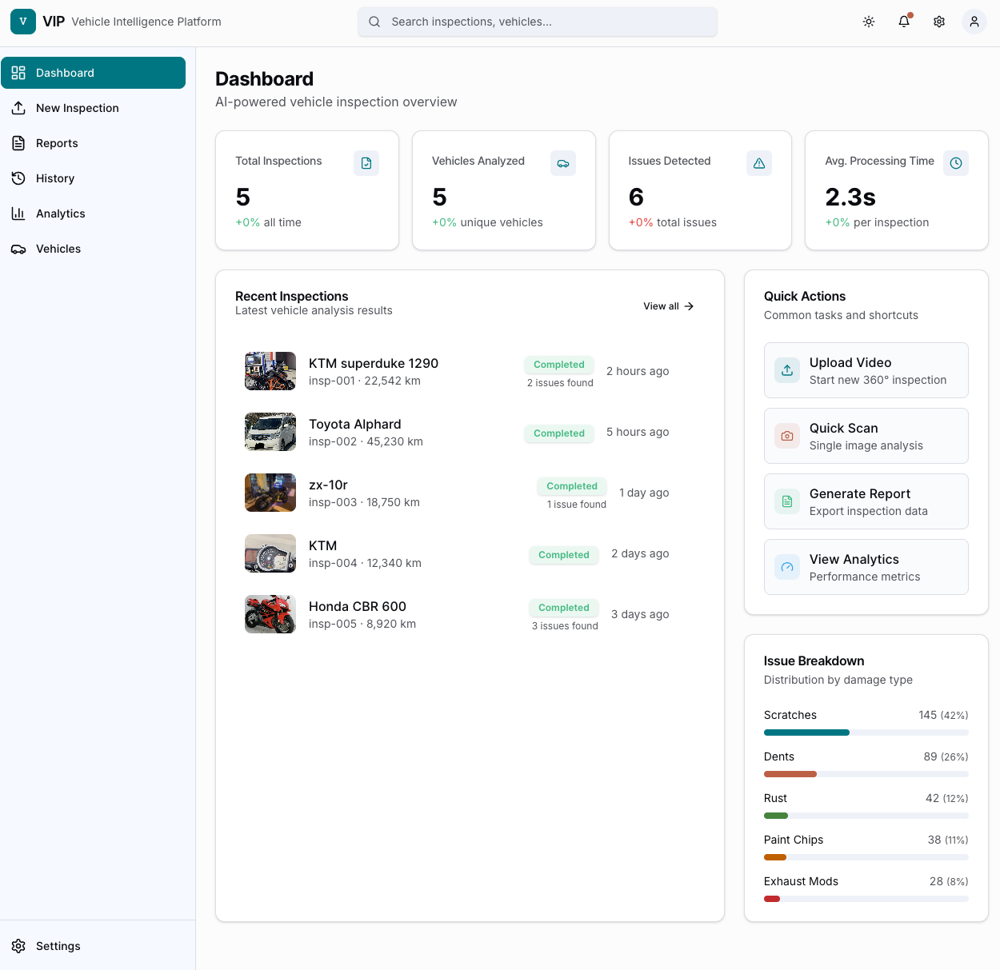

# Vehicle Intelligence Platform (VIP) - MVP

**Language / 言語:** [English](#english) | [日本語](#japanese)



---

<a id="english"></a>
# English

## Overview

This MVP system processes vehicle videos to extract:
- Vehicle type, brand, and model identification
- Odometer reading from dashboard
- Damage detection (scratches, dents, rust)
- Exhaust system classification (stock vs modified)
- Comprehensive inspection reports

## Architecture

The system consists of three main components:

1. **Frontend** (Next.js + TypeScript) - User interface for uploads and results
2. **Backend API** (Node.js + Express) - Handles uploads, job management, and data serving
3. **ML Service** (Python + FastAPI) - Processes videos and runs AI/ML models

## Project Structure

```
vehicle-intelligence/
├── frontend/          # Next.js frontend application
├── backend/           # Node.js backend API
├── ml-service/        # Python ML service
├── shared/            # Shared TypeScript types
└── .context/          # PRD and documentation
```

## Prerequisites

- Node.js 18+ and npm
- Python 3.9+
- SQLite (included with Node.js)

## Setup Instructions

### 1. Backend Setup

```bash
cd backend
npm install
npm run dev
```

The backend will run on `http://localhost:3001`

### 2. ML Service Setup

```bash
cd ml-service

# Create virtual environment (recommended)
python3 -m venv venv
source venv/bin/activate  # On Windows: venv\Scripts\activate

# Install dependencies
pip install -r requirements.txt

# Set Gemini API key (optional, for report generation)
export GEMINI_API_KEY=your_api_key_here

# Run the service
python3 src/main.py
```

The ML service will run on `http://localhost:8000`

### 3. Frontend Setup

```bash
cd frontend
npm install
npm run dev
```

The frontend will run on `http://localhost:3000`

## Environment Variables

### Backend (.env)

```env
PORT=3001
ML_SERVICE_URL=http://localhost:8000
```

### ML Service (.env)

```env
GEMINI_API_KEY=your_gemini_api_key_here
```

### Frontend (.env.local)

```env
NEXT_PUBLIC_API_URL=http://localhost:3001/api
```

## Usage

1. Start all three services (backend, ML service, frontend)
2. Navigate to `http://localhost:3000`
3. Upload a 360-degree vehicle video (MP4 format)
4. Wait for processing to complete
5. View inspection results

## API Endpoints

### Backend API (`http://localhost:3001/api`)

- `POST /upload` - Upload video file
- `GET /jobs/:id` - Get job status
- `GET /inspections` - Get all inspections
- `GET /inspections/:id` - Get inspection by ID

### ML Service API (`http://localhost:8000/api`)

- `POST /process` - Process video and extract inspection data
- `GET /health` - Health check

## Technology Stack

### Frontend

- Next.js 14
- TypeScript
- Tailwind CSS
- Axios

### Backend

- Node.js
- Express
- TypeScript
- SQLite (better-sqlite3)
- Multer (file uploads)

### ML Service

- Python 3.9+
- FastAPI
- OpenCV (frame extraction)
- YOLOv8 (object detection)
- CLIP (vehicle identification)
- PaddleOCR (OCR)
- Google Gemini (report generation)

## Limitations (MVP)

- Uses general-purpose models (not custom-trained for vehicles)
- OCR accuracy depends on video quality
- Damage detection uses heuristics (not specialized models)
- Exhaust classification is simplified

## Future Enhancements

- Custom-trained models for vehicle-specific tasks
- Real-time processing and Background Jobs
- Mobile application
- Audio-based exhaust analysis

---

<a id="japanese"></a>
# 日本語

## 概要

このMVPシステムは、車両動画を処理して以下を抽出します：
- 車種、ブランド、モデルの識別
- ダッシュボードからの走行距離の読み取り
- 損傷検出（傷、へこみ、錆）
- 排気システムの分類（純正 vs 改造）
- 包括的な検査レポート

## アーキテクチャ

システムは3つの主要コンポーネントで構成されています：

1. **フロントエンド** (Next.js + TypeScript) - アップロードと結果のユーザーインターフェース
2. **バックエンドAPI** (Node.js + Express) - アップロード、ジョブ管理、データ提供を処理
3. **MLサービス** (Python + FastAPI) - 動画を処理し、AI/MLモデルを実行

## プロジェクト構造

```
vehicle-intelligence/
├── frontend/          # Next.jsフロントエンドアプリケーション
├── backend/           # Node.jsバックエンドAPI
├── ml-service/        # Python MLサービス
├── shared/            # 共有TypeScript型定義
└── .context/          # PRDとドキュメント
```

## 前提条件

- Node.js 18+ および npm
- Python 3.9+
- SQLite (Node.jsに含まれています)

## セットアップ手順

### 1. バックエンドのセットアップ

```bash
cd backend
npm install
npm run dev
```

バックエンドは `http://localhost:3001` で実行されます

### 2. MLサービスのセットアップ

```bash
cd ml-service

# 仮想環境の作成（推奨）
python3 -m venv venv
source venv/bin/activate  # Windowsの場合: venv\Scripts\activate

# 依存関係のインストール
pip install -r requirements.txt

# Gemini APIキーの設定（オプション、レポート生成用）
export GEMINI_API_KEY=your_api_key_here

# サービスの実行
python3 src/main.py
```

MLサービスは `http://localhost:8000` で実行されます

### 3. フロントエンドのセットアップ

```bash
cd frontend
npm install
npm run dev
```

フロントエンドは `http://localhost:3000` で実行されます

## 環境変数

### バックエンド (.env)

```env
PORT=3001
ML_SERVICE_URL=http://localhost:8000
```

### MLサービス (.env)

```env
GEMINI_API_KEY=your_gemini_api_key_here
```

### フロントエンド (.env.local)

```env
NEXT_PUBLIC_API_URL=http://localhost:3001/api
```

## 使用方法

1. 3つのサービス（バックエンド、MLサービス、フロントエンド）を起動
2. `http://localhost:3000` にアクセス
3. 360度車両動画（MP4形式）をアップロード
4. 処理が完了するまで待機
5. 検査結果を表示

## APIエンドポイント

### バックエンドAPI (`http://localhost:3001/api`)

- `POST /upload` - 動画ファイルのアップロード
- `GET /jobs/:id` - ジョブステータスの取得
- `GET /inspections` - すべての検査の取得
- `GET /inspections/:id` - IDによる検査の取得

### MLサービスAPI (`http://localhost:8000/api`)

- `POST /process` - 動画を処理して検査データを抽出
- `GET /health` - ヘルスチェック

## 技術スタック

### フロントエンド

- Next.js 14
- TypeScript
- Tailwind CSS
- Axios

### バックエンド

- Node.js
- Express
- TypeScript
- SQLite (better-sqlite3)
- Multer (ファイルアップロード)

### MLサービス

- Python 3.9+
- FastAPI
- OpenCV (フレーム抽出)
- YOLOv8 (物体検出)
- CLIP (車両識別)
- PaddleOCR (OCR)
- Google Gemini (レポート生成)

## 制限事項（MVP）

- 汎用モデルを使用（車両専用にカスタムトレーニングされていない）
- OCRの精度は動画の品質に依存
- 損傷検出はヒューリスティックを使用（専用モデルではない）
- 排気システムの分類は簡略化されている

## 今後の改善

- 車両専用タスクのためのカスタムトレーニングモデル
- リアルタイム処理とバックグラウンドジョブ
- モバイルアプリケーション
- 音声ベースの排気分析
