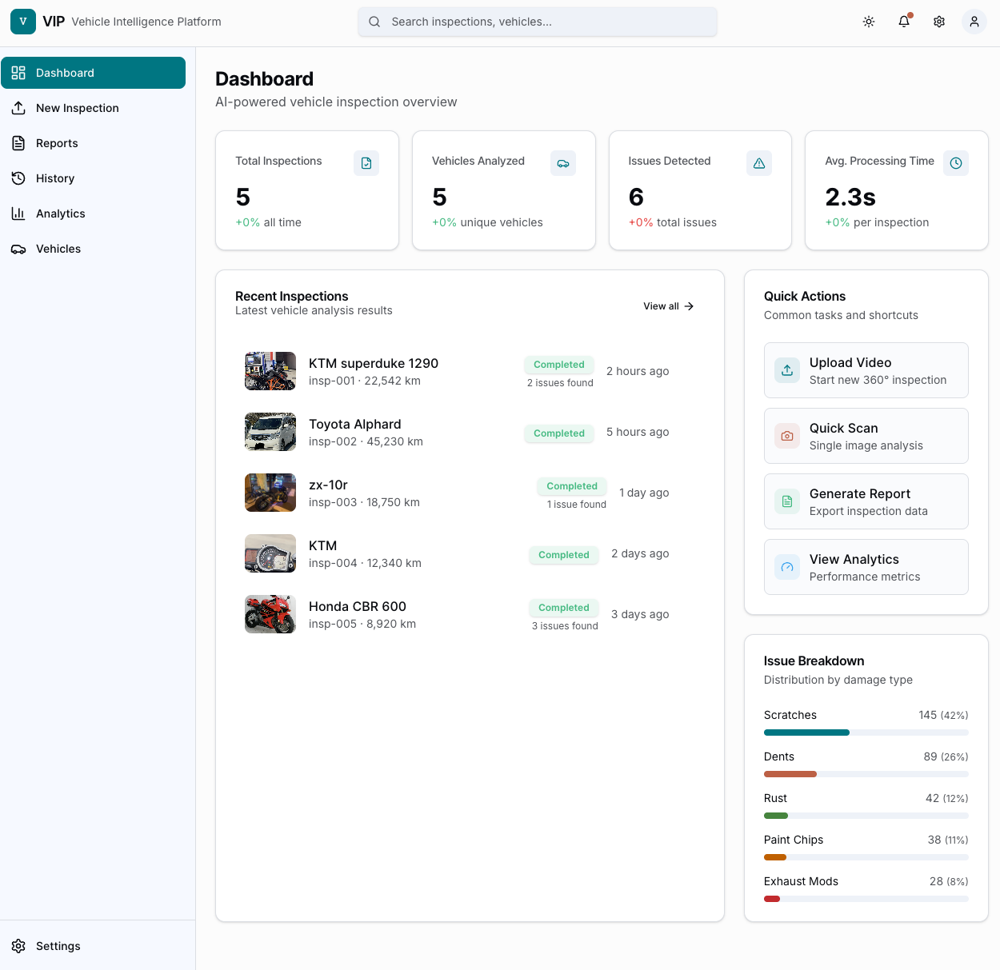

# Vehicle Intelligence Platform (VIP) - MVP

**Language / 言語:** [English](#english) | [日本語](#japanese)



---

<a id="english"></a>
# English

## Overview

This MVP system processes vehicle videos to extract:
- Vehicle type, brand, model, category, year, and trim/version evidence
- Odometer reading from dashboard
- Damage detection (scratches, dents, rust, cracks, paint damage)
- Modification assessment (stock vs modified visible parts)
- Comprehensive inspection reports

## Architecture

The system consists of three main components:

1. **Frontend** (Next.js + TypeScript) - User interface for uploads and results
2. **Backend API** (Node.js + Express) - Handles uploads, job management, and data serving
3. **ML Service** (Python + FastAPI) - Processes videos and runs AI/ML models

## Project Structure

```
vehicle-intelligence/
├── frontend/          # Next.js frontend application
├── backend/           # Node.js backend API
├── ml-service/        # Python ML service
├── shared/            # Shared TypeScript types
└── .context/          # PRD and documentation
```

## Prerequisites

- Node.js 18+ and npm
- Python 3.10+ (3.12 recommended for local setup)
- SQLite (included with Node.js)

## Setup Instructions

### 1. Backend Setup

```bash
cd backend
npm install
npm run dev
```

The backend will run on `http://localhost:3001`

### 2. ML Service Setup

```bash
cd ml-service

# Create virtual environment (recommended)
python3 -m venv venv
source venv/bin/activate  # On Windows: venv\Scripts\activate

# Install dependencies
pip install -r requirements.txt

# Set VLM keys. Gemini is primary; OpenAI is the fallback for quota/billing limits.
# You can put these in ../.env or ml-service/.env; both are loaded.
export GEMINI_API_KEY=your_api_key_here
export OPENAI_API_KEY=your_api_key_here
# Optional for local/internal OpenAI-compatible VLM endpoints
export OPENAI_BASE_URL=http://localhost:11434/v1
export UPLOADS_ROOT=/app/uploads

# Run the service
python3 src/main.py
```

The ML service will run on `http://localhost:8000`

### 3. Frontend Setup

```bash
cd frontend
npm install
npm run dev
```

The frontend will run on `http://localhost:3000`

## Environment Variables

### Backend (.env)

```env
PORT=3001
ML_SERVICE_URL=http://localhost:8000
```

### ML Service (.env)

```env
GEMINI_API_KEY=your_gemini_api_key_here
OPENAI_API_KEY=your_openai_api_key_here
OPENAI_BASE_URL=http://localhost:11434/v1
```

The ML service loads both `ml-service/.env` and the repo root `.env`, so adding
`OPENAI_API_KEY` to either location is enough for local processing, readiness
checks, and `retry_vlm_analysis.py`. Docker Compose reads the repo root `.env`.

### Frontend (.env.local)

```env
NEXT_PUBLIC_API_URL=http://localhost:3001/api
```

## Usage

1. Start all three services (backend, ML service, frontend)
2. Navigate to `http://localhost:3000`
3. Upload a 360-degree vehicle video (MP4 format)
4. Wait for processing to complete
5. View inspection results and the pipeline verification status

## API Endpoints

### Backend API (`http://localhost:3001/api`)

- `POST /upload` - Upload video file
- `GET /jobs/:id` - Get job status
- `GET /inspections` - Get all inspections
- `GET /inspections/:id` - Get inspection by ID
- `PUT /inspections/:id/identity` - Merge trusted identity evidence into an existing inspection
- `PUT /inspections/:id/vlm` - Merge externally generated VLM evidence into an existing inspection
- `POST /inspections/:id/retry-vlm` - Rerun live VLM analysis from saved organized frames after provider keys/quota are available

### ML Service (`http://localhost:8000`)

- `POST /api/process` - Process video and extract inspection data
- `GET /health` - Health check
- `GET /ready` - Dependency readiness check; pass `?live_gemini=true&live_openai=true` to verify VLM quota/key status

## Pipeline Verification

The ML service includes a stricter completion audit for real walkaround videos:

```bash
cd ml-service
python3 scripts/check_pipeline_readiness.py --live-gemini --live-openai --json > /tmp/vip-readiness.json
python3 scripts/evaluate_video_understanding.py ../360.mov --with-models --read-odometer \
  --output-dir /tmp/vip-video-eval \
  --min-coverage 0.75 --min-high-confidence-coverage 0.5 \
  --min-dashboard-candidates 1 --min-odometer-confidence 0.5
python3 scripts/audit_pipeline_completion.py \
  --manifest /tmp/vip-video-eval/frame_analysis_manifest.json \
  --inspection-json /path/to/process_response.json \
  --readiness-json /tmp/vip-readiness.json
python3 scripts/retry_vlm_analysis.py \
  --inspection-json /path/to/process_response_or_backend_inspection.json \
  --export-request-json /tmp/vip-external-vlm-request.json
python3 scripts/retry_vlm_analysis.py \
  --inspection-json /path/to/process_response_or_backend_inspection.json \
  --output-json /tmp/vip-vlm-retry.json \
  --merged-output-json /tmp/vip-process-response-with-vlm.json \
  --vlm-result-json /path/to/external_vlm_result.json \
  --identity-override-json /path/to/trusted_identity.json
```

The completion audit requires model-backed angle selection, temporal coverage
across at least 90% of the source video, named front/rear/side/quarter plus
interior/dashboard views, selected-frame quality, odometer confidence, live VLM
availability, exact maker/model/year/trim/type/category identity, the full
damage schema, confidence-aware inspection section routing, at least three
concrete stock/modified part categories, and an inspection summary. Local-only
candidates are useful for triage, but exact year/trim acceptance requires live
VLM evidence, VIN/registration data, or manual confirmation. Multi-part
modification evidence can come from the local CLIP modification scan, VLM,
exhaust classifier, VIN/registration data, or manual confirmation.

The upload API and upload form accept optional identity evidence fields such as
`vehicle_brand`, `vehicle_model`, `vin`, `registration`, `vehicle_year`, and
`vehicle_variant`, plus `vehicle_type` and `vehicle_category`. When supplied,
the ML service merges them after video analysis and marks the identity source
instead of guessing exact year/trim from video-only evidence. For completed
inspections, `PUT /api/inspections/:id/identity` can merge the same trusted
evidence later and clears stale embedded audit status so the inspection can be
audited again. `PUT /api/inspections/:id/vlm` can merge externally generated
VLM evidence into the same persisted inspection shape. After adding
`OPENAI_API_KEY` or fixing provider quota, `POST /api/inspections/:id/retry-vlm`
reruns the live VLM pass from the saved organized frame package.

If the original run fails because Gemini/OpenAI quota or keys are unavailable,
`retry_vlm_analysis.py` reruns only the VLM step from the saved organized frames.
Use `--merged-output-json` to create a process-response-shaped artifact and then
rerun `audit_pipeline_completion.py` against that merged JSON. If exact identity
evidence arrives after the upload, pass `--identity-override-json` with trusted
fields such as `year`, `variant`, `vin`, or `registration`; the retry artifact
will preserve the evidence source and drop the stale embedded audit. Use
`--skip-vlm` with `--identity-override-json` when you only need to attach trusted
identity evidence and do not want to call Gemini/OpenAI. OpenAI-compatible
endpoints are tried through the Responses API first, then Chat Completions for
local servers that do not implement Responses. If VLM evidence is generated
outside the service, pass it with `--vlm-result-json` to merge it into the same
auditable process-response artifact without making a provider call. The imported
JSON must include boolean `available`; when `available` is `true`, include a
`vehicle` object with maker/model/year/trim/type/category evidence. When no
provider is available locally, `--export-request-json` writes the exact prompt,
selected organized frame paths, frame metadata, and expected response schema for
external VLM review; add `--include-image-data` to embed base64 image data. For
imported external VLM evidence, keep the merged artifact and rerun
`audit_pipeline_completion.py` with `--no-require-live-vlm`; the default audit
still requires the current runtime to have a live VLM path.

The generated `inspection_analysis` artifact is the production UI-routing
contract. It separates extraction, VLM evidence, classification validation, and
frontend mapping: organized frames are scored for usability and foreground
vehicle evidence, VLM/local evidence is normalized into canonical car sections,
conflicts such as dashboard-versus-wheel or tyre-versus-interior are resolved,
and the frontend renders the routed sections before falling back to raw
organizer output. Keep new providers behind the inspection analysis provider
boundary or the existing Gemini/OpenAI-compatible VLM adapter so API keys stay
in `.env` files and the UI continues to receive stable section labels,
confidence scores, timestamps, rejected-frame reasons, and raw model metadata.

## Technology Stack

### Frontend

- Next.js 14
- TypeScript
- Tailwind CSS
- Axios

### Backend

- Node.js
- Express
- TypeScript
- SQLite (better-sqlite3)
- Multer (file uploads)

### ML Service

- Python 3.10+
- FastAPI
- OpenCV (frame extraction)
- YOLOv8 (object detection)
- CLIP (vehicle identification)
- PaddleOCR (OCR)
- Google Gemini / OpenAI vision fallback (VLM inspection analysis)

## Limitations (MVP)

- Uses general-purpose models (not custom-trained for vehicles)
- OCR accuracy depends on video quality
- Damage detection uses heuristics (not specialized models)
- Exhaust-only modification fallback is incomplete; full stock/modified status needs evidence across multiple visible part categories

## Future Enhancements

- Custom-trained models for vehicle-specific tasks
- Real-time processing and Background Jobs
- Mobile application
- Audio-based exhaust analysis

---

<a id="japanese"></a>
# 日本語

## 概要

このMVPシステムは、車両動画を処理して以下を抽出します：
- 車種、ブランド、モデル、カテゴリ、年式、トリム/バージョンの証拠
- ダッシュボードからの走行距離の読み取り
- 損傷検出（傷、へこみ、錆、ひび、塗装ダメージ）
- 改造評価（表示可能な部品の純正 vs 改造）
- 包括的な検査レポート

## アーキテクチャ

システムは3つの主要コンポーネントで構成されています：

1. **フロントエンド** (Next.js + TypeScript) - アップロードと結果のユーザーインターフェース
2. **バックエンドAPI** (Node.js + Express) - アップロード、ジョブ管理、データ提供を処理
3. **MLサービス** (Python + FastAPI) - 動画を処理し、AI/MLモデルを実行

## プロジェクト構造

```
vehicle-intelligence/
├── frontend/          # Next.jsフロントエンドアプリケーション
├── backend/           # Node.jsバックエンドAPI
├── ml-service/        # Python MLサービス
├── shared/            # 共有TypeScript型定義
└── .context/          # PRDとドキュメント
```

## 前提条件

- Node.js 18+ および npm
- Python 3.10+ (ローカルセットアップでは 3.12 を推奨)
- SQLite (Node.jsに含まれています)

## セットアップ手順

### 1. バックエンドのセットアップ

```bash
cd backend
npm install
npm run dev
```

バックエンドは `http://localhost:3001` で実行されます

### 2. MLサービスのセットアップ

```bash
cd ml-service

# 仮想環境の作成（推奨）
python3 -m venv venv
source venv/bin/activate  # Windowsの場合: venv\Scripts\activate

# 依存関係のインストール
pip install -r requirements.txt

# VLMキーの設定。Geminiが主経路、OpenAIはクォータ/課金制限時のフォールバック。
export GEMINI_API_KEY=your_api_key_here
export OPENAI_API_KEY=your_api_key_here
# ローカル/社内のOpenAI互換VLMエンドポイント用（任意）
export OPENAI_BASE_URL=http://localhost:11434/v1
export UPLOADS_ROOT=/app/uploads

# サービスの実行
python3 src/main.py
```

MLサービスは `http://localhost:8000` で実行されます

### 3. フロントエンドのセットアップ

```bash
cd frontend
npm install
npm run dev
```

フロントエンドは `http://localhost:3000` で実行されます

## 環境変数

### バックエンド (.env)

```env
PORT=3001
ML_SERVICE_URL=http://localhost:8000
```

### MLサービス (.env)

```env
GEMINI_API_KEY=your_gemini_api_key_here
OPENAI_API_KEY=your_openai_api_key_here
OPENAI_BASE_URL=http://localhost:11434/v1
```

### フロントエンド (.env.local)

```env
NEXT_PUBLIC_API_URL=http://localhost:3001/api
```

## 使用方法

1. 3つのサービス（バックエンド、MLサービス、フロントエンド）を起動
2. `http://localhost:3000` にアクセス
3. 360度車両動画（MP4形式）をアップロード
4. 処理が完了するまで待機
5. 検査結果とパイプライン検証ステータスを表示

## APIエンドポイント

### バックエンドAPI (`http://localhost:3001/api`)

- `POST /upload` - 動画ファイルのアップロード
- `GET /jobs/:id` - ジョブステータスの取得
- `GET /inspections` - すべての検査の取得
- `GET /inspections/:id` - IDによる検査の取得
- `PUT /inspections/:id/identity` - 既存の検査へ信頼済み識別証拠をマージ
- `PUT /inspections/:id/vlm` - 既存の検査へ外部生成VLM証拠をマージ

### MLサービス (`http://localhost:8000`)

- `POST /api/process` - 動画を処理して検査データを抽出
- `GET /health` - ヘルスチェック
- `GET /ready` - 依存関係のレディネスチェック。VLMクォータ/キー確認には `?live_gemini=true&live_openai=true` を付与

## パイプライン検証

MLサービスには、実際のウォークアラウンド動画向けの厳格な完了監査があります：

```bash
cd ml-service
python3 scripts/check_pipeline_readiness.py --live-gemini --live-openai --json > /tmp/vip-readiness.json
python3 scripts/evaluate_video_understanding.py ../360.mov --with-models --read-odometer \
  --output-dir /tmp/vip-video-eval \
  --min-coverage 0.75 --min-high-confidence-coverage 0.5 \
  --min-dashboard-candidates 1 --min-odometer-confidence 0.5
python3 scripts/audit_pipeline_completion.py \
  --manifest /tmp/vip-video-eval/frame_analysis_manifest.json \
  --inspection-json /path/to/process_response.json \
  --readiness-json /tmp/vip-readiness.json
python3 scripts/retry_vlm_analysis.py \
  --inspection-json /path/to/process_response_or_backend_inspection.json \
  --output-json /tmp/vip-vlm-retry.json \
  --merged-output-json /tmp/vip-process-response-with-vlm.json \
  --vlm-result-json /path/to/external_vlm_result.json \
  --identity-override-json /path/to/trusted_identity.json
```

完了監査では、モデルベースの角度選択、動画全体の少なくとも90%の時間範囲カバー、
前後左右/斜め方向に加えて内装とダッシュボードのビュー、選択フレーム品質、
走行距離信頼度、ライブVLM、メーカー/モデル/年式/トリム/種別/カテゴリの正確な識別、
5分類の損傷スキーマ、少なくとも3つの部品カテゴリに対する純正/改造判定、
検査サマリーが必要です。ローカルのみの候補はトリアージには有用ですが、
年式/トリムを確定するには、ライブVLM、VIN/登録情報、または手動確認が必要です。
複数部品の改造判定の証拠は、ローカルCLIP改造スキャン、VLM、排気分類器、
VIN/登録情報、または手動確認から取得できます。

アップロードAPIとアップロードフォームは、`vehicle_brand`、`vehicle_model`、
`vin`、`registration`、`vehicle_year`、`vehicle_variant`、`vehicle_type`、
`vehicle_category` などの任意の識別証拠フィールドを受け取れます。
指定された場合、MLサービスは動画分析後にそれらをマージし、動画のみで
年式/トリムを推測せずに識別ソースを記録します。完了済みの検査では、
`PUT /api/inspections/:id/identity` で同じ信頼済み証拠を後からマージでき、
再監査できるように古い埋め込み監査ステータスを削除します。
`PUT /api/inspections/:id/vlm` では、外部生成されたVLM証拠を同じ保存済み検査形式へマージできます。

元の実行がGemini/OpenAIのクォータやキー不足で失敗した場合は、
`retry_vlm_analysis.py` で保存済みの整理済みフレームからVLMステップだけを再実行できます。
`--merged-output-json` を使うと process response 形式の成果物を作成でき、
そのJSONに対して `audit_pipeline_completion.py` を再実行できます。アップロード後に
正確な識別証拠が得られた場合は、`year`、`variant`、`vin`、`registration` などを含む
信頼済みJSONを `--identity-override-json` で渡せます。再試行成果物には証拠ソースが残り、
古い埋め込み監査は削除されます。Gemini/OpenAIを呼ばずに識別証拠だけを付与する場合は、
`--identity-override-json` と一緒に `--skip-vlm` を使います。OpenAI互換エンドポイントは
Responses APIを先に試し、Responses未対応のローカルサーバーではChat Completionsにフォールバックします。
外部で生成したVLM証拠がある場合は、`--vlm-result-json` で渡すと、プロバイダー呼び出しなしで
同じ監査可能な process response 成果物へマージできます。インポートするJSONには boolean の
`available` が必要で、`available` が `true` の場合はメーカー/モデル/年式/トリム/種別/カテゴリを含む
`vehicle` オブジェクトを含めます。外部VLM証拠をインポートした成果物を監査する場合は、
マージ済み成果物を証拠として保持し、`audit_pipeline_completion.py` に `--no-require-live-vlm`
を渡します。デフォルトの監査では、現在のランタイムにライブVLM経路があることを引き続き要求します。

## 技術スタック

### フロントエンド

- Next.js 14
- TypeScript
- Tailwind CSS
- Axios

### バックエンド

- Node.js
- Express
- TypeScript
- SQLite (better-sqlite3)
- Multer (ファイルアップロード)

### MLサービス

- Python 3.10+
- FastAPI
- OpenCV (フレーム抽出)
- YOLOv8 (物体検出)
- CLIP (車両識別)
- PaddleOCR (OCR)
- Google Gemini / OpenAI vision fallback (VLM検査分析)

## 制限事項（MVP）

- 汎用モデルを使用（車両専用にカスタムトレーニングされていない）
- OCRの精度は動画の品質に依存
- 損傷検出はヒューリスティックを使用（専用モデルではない）
- 排気のみの改造フォールバックは未完了扱い。完全な純正/改造判定には複数の表示可能な部品カテゴリの証拠が必要

## 今後の改善

- 車両専用タスクのためのカスタムトレーニングモデル
- リアルタイム処理とバックグラウンドジョブ
- モバイルアプリケーション
- 音声ベースの排気分析
